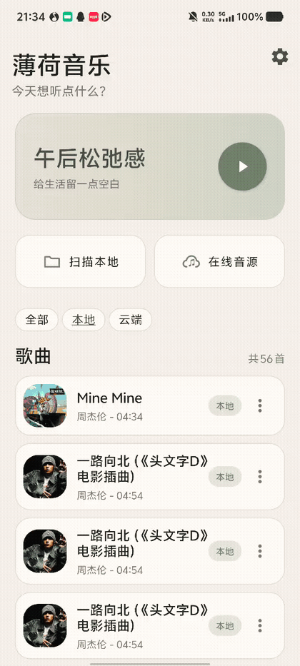
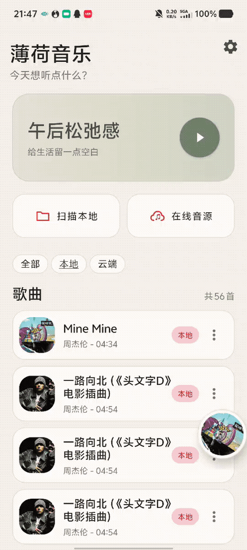
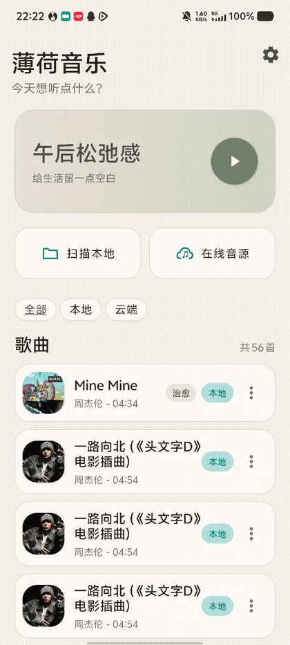
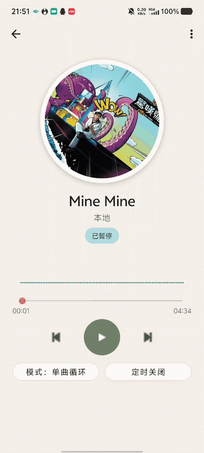

# MintMusic（薄荷音乐）

MintMusic 是一款以本地曲库为核心、同时支持在线音源的 Android 音乐播放器。项目采用 Kotlin、XML/ViewBinding 和 AndroidX Media3，实现后台播放、系统媒体控制、增量曲库扫描、同步歌词、睡眠定时、主题换色与可选的歌曲情绪分析。

> 当前版本：`1.0` · 最低 Android 8.0（API 26）· 目标 Android 14（API 34）

## 功能演示

### 本地曲库与筛选

通过 Android Storage Access Framework 选择音乐文件夹；应用会读取曲目信息与内嵌封面，并支持“全部 / 本地 / 云端”快速筛选。


<!--  -->

### 播放器与迷你播放器

播放器提供封面旋转、实时频谱、进度拖动、上一首、播放/暂停、下一首、播放模式切换和睡眠定时；返回曲库后可继续使用悬浮迷你播放器控制播放。


<!--  -->

### 在线同步歌词

播放器可根据歌曲标题、歌手、专辑和时长匹配在线 LRC。匹配成功后，向左滑进入同步歌词页，向右滑返回封面页。


<!--  -->

### 主题颜色

内置薄荷绿、天空蓝、青色、紫色、靛蓝、粉色、橙色和红色八套主题，并适配系统深色模式。


<!--  -->

### 在线音源

可以维护 HTTP/HTTPS 音频流，设置名称和可选封面 URL，并从在线音源列表直接开始播放。

> GIF 预留：`docs/assets/demos/cloud-sources.gif`

<!--  -->

### 歌曲情绪分析

本地歌曲可选择上传到自建 Music2Emo 服务分析情绪标签、愉悦度和能量。服务完成推理后会删除临时音频。


<!--  -->

## 主要功能

### 曲库管理

- 使用 SAF 授权文件夹，无需申请整个存储空间的访问权限。
- 增量扫描本地音频，根据 URI、文件大小与修改时间识别变化。
- 支持 MP3、WAV、FLAC、AAC、M4A、OGG、Opus、AMR 和 MIDI 等常见格式。
- 读取音频元数据与内嵌封面；封面按需加载并使用 Coil 缓存。
- 支持全部、本地、云端筛选，以及歌曲多选和批量删除。
- 支持手动修改或隐藏歌曲情绪标签。

### 播放体验

- 基于 Media3 ExoPlayer、`MediaSessionService` 和 `MediaController`。
- 支持后台播放、通知栏控制、系统媒体面板和断点续播。
- 支持顺序播放、单曲循环、列表循环和随机播放。
- 支持 15、30、45、60 分钟睡眠定时，并显示剩余时间。
- 播放页包含旋转封面、实时音频频谱、进度拖动和缓冲状态。
- 曲库页提供可拖动、自动吸附屏幕边缘的迷你播放器。
- 网络音频遇到临时故障时，会等待网络恢复并进行指数退避重试。

### 歌词

- 从 LrcAPI 和 LRCLIB 查询带时间轴的 LRC，优先采用 LrcAPI。
- 使用标题、歌手、专辑和时长约束匹配，降低同名歌曲误配风险。
- 只接受包含 LRC 时间标签的同步歌词，不用纯文本覆盖现有歌词。
- 匹配结果保存到应用私有目录，下一次打开歌曲时直接读取。
- 歌词随播放进度滚动，并通过左右滑动在封面页和歌词页之间切换。

应用中的“智能获取歌词”指在线曲库匹配，并不会上传音频或使用 AI 转录。没有可靠匹配时会明确失败，不生成猜测歌词。

### 主题与界面

- Editorial 风格首页、圆形唱片封面与动态频谱。
- 八套强调色主题，主题选择会本地持久化。
- 支持系统深色模式、状态栏和导航栏颜色适配。
- 中文为默认界面语言，同时提供主要英文字符串资源。

### 可选情绪分析

- 使用 WorkManager 在后台提交分析任务。
- 服务端可接入官方 Music2Emotion 项目，返回情绪、valence 和 arousal。
- 单次上传最大 80 MB；请求结束后删除服务端临时目录。
- 模型或 CUDA 环境不可用时返回明确错误，不使用模拟结果代替推理。

## 技术架构

| 层级   | 主要实现                                   | 职责                     |
| ---- | -------------------------------------- | ---------------------- |
| UI   | AppCompat、XML、ViewBinding、RecyclerView | 曲库、播放器、在线音源和主题界面       |
| 状态   | ViewModel、StateFlow                    | 合并曲库、播放、歌词与情绪状态        |
| 播放   | Media3 ExoPlayer、MediaSessionService   | 后台播放、媒体会话、队列和系统控制      |
| 数据   | Room、DataStore                         | 曲库索引、播放历史、队列与轻量设置      |
| 后台任务 | WorkManager                            | 歌词查询和歌曲情绪分析            |
| 网络   | OkHttp、Media3 OkHttp DataSource        | API 请求、在线流播放和弱网恢复      |
| 图片   | Coil                                   | 本地封面和远程封面加载与缓存         |
| 辅助服务 | FastAPI                                | 同步歌词匹配和可选 Music2Emo 推理 |

播放进度每 500 ms 更新一次可见 UI；持久化采用节流策略，并在暂停、切歌、拖动和错误等关键节点立即保存。Room 是曲库、在线音源、播放队列和历史记录的主要数据源，DataStore 保存目录与播放模式等轻量设置。

## 项目结构

```text
MintMusic/
├─ app/                         Android 应用
│  ├─ src/main/java/.../
│  │  ├─ data/                  Room、扫描和数据仓库
│  │  ├─ emotion/               情绪分析任务与状态
│  │  ├─ lyrics/                LRC 解析、保存和歌词视图
│  │  ├─ network/               服务地址与弱网恢复
│  │  ├─ playback/              Media3 播放栈与频谱
│  │  └─ ui/                    ViewModel、格式化和主题
│  └─ src/main/res/             布局、主题、图标与字符串
├─ macrobenchmark/              Android 宏基准模块
├─ server/                      FastAPI 歌词与情绪服务
├─ scripts/                     安装与设备辅助脚本
├─ docs/                        设计和性能文档
└─ tools/toxiproxy/             弱网实验配置
```

## 开发环境

- Android Studio（支持 AGP 8.10.1）
- JDK 17
- Android SDK 36
- Gradle 8.11.1
- Kotlin 2.1.20
- Python 3.11+（仅运行辅助服务时需要）

## 构建与运行

### 1. 获取代码

```powershell
git clone https://github.com/Yuhang2Cai/MintMusic.git
cd MintMusic
```

### 2. 构建 Debug APK

```powershell
.\gradlew.bat testDebugUnitTest assembleDebug
```

生成文件：

```text
app/build/outputs/apk/debug/app-debug.apk
```

## 启动歌词服务

同步歌词匹配需要项目内的 FastAPI 服务。模拟器默认通过 `http://10.0.2.2:8000` 访问开发电脑。

```powershell
python -m venv .venv
.venv\Scripts\python -m pip install -r server\requirements.txt
.venv\Scripts\python -m uvicorn app:app --app-dir server --host 0.0.0.0 --port 8000
```

健康检查：

```powershell
curl http://127.0.0.1:8000/health
```

服务接口：

| 方法   | 路径                   | 说明             |
| ---- | -------------------- | -------------- |
| GET  | `/health`            | 服务状态和歌词模式      |
| GET  | `/v1/lyrics/lookup`  | 按元数据查询同步歌词     |
| POST | `/v1/music-emotions` | 上传本地歌曲进行可选情绪分析 |

可用环境变量：

| 变量                           | 默认值                          | 说明                 |
| ---------------------------- | ---------------------------- | ------------------ |
| `MINT_ONLINE_LYRICS_ENABLED` | `true`                       | 是否启用在线歌词查询         |
| `MINT_LRCAPI_URL`            | `https://api.lrc.cx/lyrics`  | LrcAPI 地址          |
| `MINT_LRCLIB_URL`            | `https://lrclib.net/api/get` | LRCLIB 地址          |
| `MINT_MUSIC2EMO_HOME`        | 无                            | Music2Emotion 项目目录 |

## 配置 Music2Emotion（可选）

情绪分析不是歌词功能的必需依赖。需要时按官方仓库安装：

```powershell
git clone https://github.com/AMAAI-Lab/Music2Emotion server\vendor\Music2Emotion
.venv\Scripts\python -m pip install -r server\vendor\Music2Emotion\requirements.txt
$env:MINT_MUSIC2EMO_HOME = (Resolve-Path server\vendor\Music2Emotion)
```

模型和 CUDA 依赖会显著增加磁盘与显存占用，因此 `server/vendor/`、模型缓存和运行产物不会提交到本仓库。

## 当前限制

- 在线歌词和情绪分析依赖开发电脑上的 FastAPI 服务。
- 歌词仅接受带时间轴的 LRC，不展示无时间轴纯文本歌词。
- 情绪分析仅支持本地歌曲，并需要独立的 Music2Emotion/Python/CUDA 环境。
- 在线音源需要提供可由 Media3 直接播放的 HTTP/HTTPS 音频流，受 DRM 保护的地址不受支持。
- 当前 Release 构建尚未启用代码压缩和混淆。
