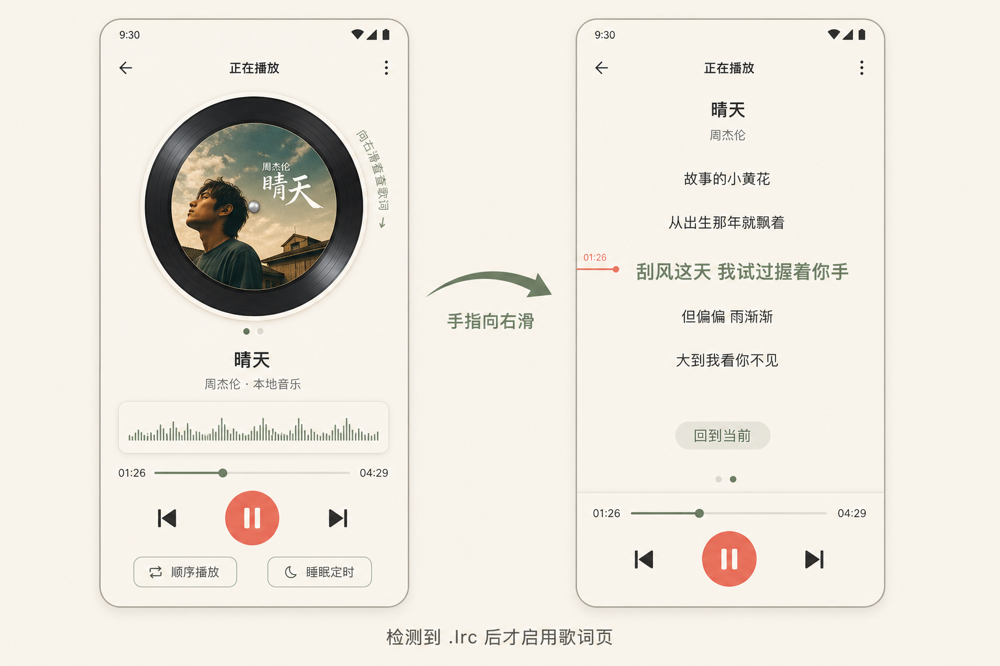
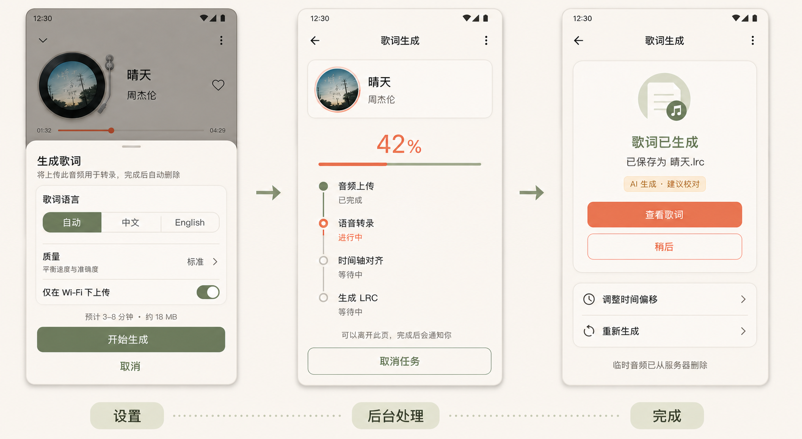

# OpenLRC 自动歌词方案

## 1. 结论

采用“Android 客户端 + 独立 Python 歌词服务”的结构。OpenLRC 不直接集成进 APK：它要求 Python 3.11+，依赖 faster-whisper、FFmpeg，放在手机端会带来安装体积、模型性能和兼容性问题。

服务端只负责音频预处理、中文/英文原声转录、时间轴和 LRC 导出；App 负责创建任务、后台续传/查询、保存歌词、同步滚动和播放控制。功能不翻译、不调用 LLM，因此不需要任何第三方 API Key。

## 2. 用户入口与交互逻辑

### 2.1 自动发现歌词

每次曲目切换时按以下优先级查找：

1. App 数据库中已经绑定到当前曲目的歌词记录；
2. 本地歌曲同目录、同文件名的 `.lrc`；
3. 以后可扩展的内嵌同步歌词；
4. 均不存在时，状态为“无歌词”。

同名判断使用规范化文件名，数据库绑定同时保存曲目 ID、文件大小和修改时间，避免文件被替换后错误复用旧歌词。

### 2.2 播放详情页右滑

- 默认仍是现有的圆形封面旋转页，不改变播放控件和视觉中心。
- 歌词页在空间上位于封面页左侧：播放器初始显示 `ViewPager2` 的封面页，用户手指向右拖动，进入歌词页。
- 仅当存在可解析的歌词时加入歌词页；没有歌词时不允许滑出空白页。
- 有歌词时显示低干扰提示“向右滑查看歌词”和双页指示点；用户成功滑动一次后不再重复提示。
- 曲目切换后默认回到封面页；如果用户在设置中开启“记住歌词页”，则保持当前页。

### 2.3 歌词页行为

- 当前句位于视觉中线，使用鼠尾草绿和更大字号；上下文句子逐级降低颜色和字号权重。
- 播放位置变化时平滑滚动；暂停时停在当前句。
- 点击任意歌词跳转到对应时间；拖动歌词列表后暂停自动跟随，并显示“回到当前”。
- 底部保留紧凑的进度条、上一首、播放/暂停、下一首，避免阅读歌词时必须返回封面页。
- 溢出菜单提供“调整时间偏移”“编辑歌词”“重新生成”“删除歌词”。时间偏移以整首 `±50 ms` 步进调整，保存为数据库元数据，不破坏原 LRC。
- 歌词只展示歌曲原语言，不提供双语行或翻译切换。

### 2.4 无歌词时的生成入口

入口放在播放器右上角溢出菜单，文案为“生成歌词”。这样不破坏圆形封面主视觉，也不会常驻一个无意义按钮。

点击后弹出底部面板：

- 歌词语言：自动 / 中文 / English；“自动”只在中文和英文之间识别；
- 输出固定为歌曲原语言，不出现输出语言或翻译选项；检测到其他语言时提示“当前仅支持中文和英文”，不创建任务；
- 质量：快速 / 标准 / 精确；
- “仅在 Wi-Fi 下上传”默认开启；
- 展示动态估算的上传大小、预计时长，以及“音频会上传并在处理后删除”的隐私提示；
- 主操作“开始生成”，次操作“取消”。

本地音频通过用户已授权的 SAF URI 读取后上传；云端音频仅支持 App 能合法、直接读取的 HTTP(S) 音源。DRM、登录态媒体和不可下载直播流第一版不支持。

### 2.5 后台任务

开始后关闭面板，任务由 WorkManager 维持。进度状态统一为：

`等待网络 → 上传音频 → 语音转录 → 时间轴对齐 → 生成 LRC → 保存`

- 用户可离开播放器，通知栏持续显示状态；回到播放器后恢复同一任务进度。
- 允许取消、失败重试；网络中断从上传断点或任务查询恢复，不重复创建任务。
- 完成后通知“歌词已生成”，播放器立即启用右滑页，并提供“查看歌词”。
- 失败信息转换为可执行文案，例如“Wi-Fi 已断开”“音频格式不支持”“服务繁忙，稍后重试”，不直接展示后端堆栈。

## 3. UI 设计图

### 播放页与歌词页



图中横向箭头表达手指向右滑的动作；实际页面结构中歌词页位于封面页左侧。检测到有效 `.lrc` 后才启用该手势。

### 生成设置、后台进度与完成



图中的时长和流量为示例，正式值由服务端根据音频时长、编码和队列状态动态返回。

## 4. 工程架构

### 4.1 Android 端

- `PlayerActivity`：将封面内容改为 `ViewPager2`，封面页仍承载圆形旋转封面；有歌词时插入歌词 Fragment。
- `PlayerViewModel`：合并播放快照与歌词状态，暴露当前句、任务进度、歌词页可用性。
- `LyricRepository`：发现/解析/保存歌词，关联曲目，管理时间偏移。
- `LyricParser`：解析标准 LRC 和增强时间标签，跳过损坏行并报告可恢复警告。
- `LyricSyncEngine`：对时间戳做二分查找，根据播放位置确定当前句。
- `LyricGenerationWorker`：上传、轮询、下载结果；使用唯一任务名 `lyrics:<trackId>` 防止重复任务。
- Room 从 v1 升级，新增 `lyrics` 与 `lyric_jobs` 表，必须提供显式迁移，不使用破坏性迁移。

建议数据字段：

```text
lyrics(id, trackId, localUri, source, language, translatedLanguage,
       offsetMs, trackSizeBytes, trackModifiedAtMs,
       contentHash, createdAtMs, updatedAtMs)

lyric_jobs(id, trackId, remoteJobId, state, progress, stage,
           errorCode, optionsJson, createdAtMs, updatedAtMs)
```

保存策略：

- 本地目录可写：保存为歌曲同名 `.lrc`，同时写数据库索引；
- 目录不可写或云端歌曲：保存到 App 私有文件目录，数据库绑定曲目；
- 删除歌词默认只删除 App 生成/管理的文件；对于用户原有同名 LRC，二次确认后再删除。

### 4.2 OpenLRC 服务

推荐 FastAPI + 队列 + GPU Worker：

```text
Android App
  ├─ 创建任务 / 分片上传 / 查询进度
  ↓
FastAPI
  ├─ 鉴权、限流、任务状态、签名下载
  ├─ 对象存储（临时音频与结果）
  ↓
任务队列（Redis + Celery/RQ）
  ↓
OpenLRC Worker
  ├─ FFmpeg 预处理
  ├─ faster-whisper 转录
  └─ 输出中文或英文原文 .lrc
```

最小 API：

```http
POST   /v1/lyric-jobs                 创建任务并返回上传信息
PUT    /v1/lyric-jobs/{id}/audio      分片/续传音频
POST   /v1/lyric-jobs/{id}/start      开始处理
GET    /v1/lyric-jobs/{id}            查询阶段、进度和错误
GET    /v1/lyric-jobs/{id}/result     下载 LRC
DELETE /v1/lyric-jobs/{id}            取消并清理
```

服务端不接受任意 URL 代下载，避免 SSRF；第一版统一由 App 上传已读取的音频。API 密钥仅放服务端。上传和结果使用 TLS、短期令牌、大小/时长限制；成功或失败后按策略自动删除临时音频，并保留可审计的删除状态。

OpenLRC 当前为 MIT 许可证，服务中应保留其版权与许可证声明。Whisper 模型和 FFmpeg 还需分别检查许可和使用条款。

服务端调用 OpenLRC 时固定关闭翻译，例如使用 `skip_trans=True`；不安装或配置 OpenAI、Anthropic、Google、OpenRouter 等密钥。

## 5. 质量档位映射

| UI 档位 | OpenLRC 策略 | 适用场景 |
| --- | --- | --- |
| 快速 | 较小 Whisper 模型、默认预处理 | 先快速得到原文时间轴 |
| 标准 | 中等模型、VAD | 默认选择，平衡速度与准确度 |
| 精确 | 更大模型、降噪 | 人声复杂、口音或高质量需求 |

具体模型名称由服务端配置下发，App 不硬编码，便于后续替换模型和控制成本。

## 6. 关键风险与 PoC 门槛

OpenLRC 已能从音频生成 LRC，但其 README 的待办仍包含“人声/伴奏分离”，歌曲转录示例也尚未完成。音乐中的伴奏、混响、和声会显著影响 Whisper 的识别与时间轴，因此不能只用播客样本判断可用性。

正式开发前先用 20 首覆盖中文、英文、说唱、现场、强伴奏、纯音乐的样本做 PoC：

- 纯音乐应识别为“未检测到稳定人声”，不生成幻觉歌词；
- 统计歌词可读性、时间轴误差、失败率、平均耗时、GPU 显存和单曲成本；
- 若强伴奏样本达不到可接受门槛，在 OpenLRC 前增加 Demucs 等人声分离预处理，但该组件的模型许可、算力和额外延迟需要单独评估；
- UI 必须始终标注“AI 生成 · 建议校对”，并保留重新生成与时间偏移修正。

## 7. 实施阶段

1. **歌词基础能力**：LRC 解析、同名发现、数据库迁移、同步滚动、点击跳转。
2. **播放器双页 UI**：保留圆形旋转封面，加入条件式歌词页、右滑手势、页面指示与紧凑控制栏。
3. **OpenLRC 服务 PoC**：单音频生成原文 LRC，验证时间轴质量、耗时、GPU/CPU成本和清理机制。
4. **生成任务闭环**：设置面板、上传、WorkManager、进度、取消/重试、通知、结果保存。
5. **校对能力**：偏移校准、编辑/重新生成、错误恢复。
6. **发布准备**：隐私说明、额度/限流、监控、依赖许可证清单、服务容量测试。

## 8. 验收标准

- 没有歌词时，播放器仍是当前圆形旋转封面页，右滑不会进入空页。
- 存在可解析 LRC 时，封面页手指向右滑可进入歌词页；当前歌词与播放位置同步误差目标不超过 200 ms（源 LRC 本身误差除外）。
- 点击歌词可 seek；人工滚动后不抢夺滚动位置，“回到当前”可恢复跟随。
- App 退后台、进程重建或网络短暂中断后，生成任务可恢复，不重复计费/生成。
- 取消任务后停止上传/处理并清理临时音频；完成后结果可在离线状态读取。
- API 密钥不进入 APK、日志或数据库；服务端拒绝未授权任务和超限音频。
- 每一个 Android UI 实施改动都在指定模拟器上用自动化操作验证，覆盖无歌词、生成中、生成成功、有歌词滑动、错误与弹层状态；每项最多调整 5 次，第 5 次仍不通过则停止并报告剩余问题。

## 9. 第一版范围

包含：中文或英文原歌词 LRC、后台生成、歌词同步、整首偏移、重新生成、本地与可读取云端音频。

暂不包含：歌词翻译、双语歌词、逐字卡拉 OK、桌面端本地模型、多人协作校对、在线歌词市场、DRM/直播流、自动对齐用户提供的纯文本歌词，以及中文/英文以外的语言。

## 参考

- OpenLRC 仓库与 README：https://github.com/zh-plus/openlrc
- OpenLRC Python 依赖与版本：https://github.com/zh-plus/openlrc/blob/master/pyproject.toml
- OpenLRC MIT License：https://github.com/zh-plus/openlrc/blob/master/LICENSE
